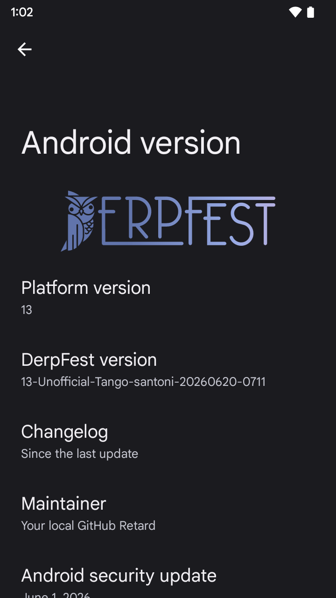
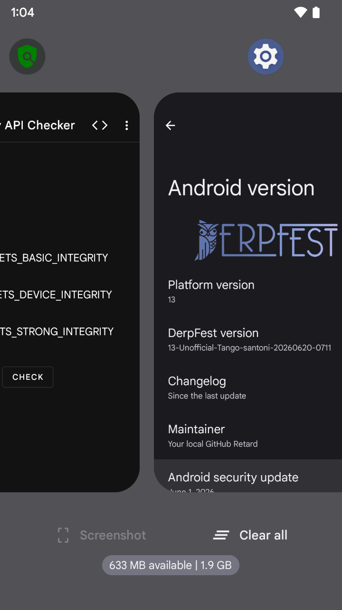

# DerpFest 13 — Xiaomi Redmi 4X (santoni)

Unofficial DerpFest Android 13 for Xiaomi Redmi 4X (santoni).

Maintained by [ziachi](https://github.com/ziachi).

## Repository Map

This build requires DerpFest source + 7 custom repos. All patches are committed to forks — no manual/local patches needed.

| # | Component | Repository | Branch | Path in source tree |
|:-:|:----------|:-----------|:-------|:--------------------|
| 1 | **Device Tree** | [ziachi/device_xiaomi_santoni_derpfest](https://github.com/ziachi/device_xiaomi_santoni_derpfest) | `derp-13-dev` | `device/xiaomi/santoni` |
| 2 | **Kernel** (source ref) | [ziachi/kernel_xiaomi_msm8937_derpfest](https://github.com/ziachi/kernel_xiaomi_msm8937_derpfest) | `derp-13-dev` | `kernel/xiaomi/msm8937` (prebuilt: Luuvy C.4.0) |
| 3 | **Vendor (device)** | [ziachi/vendor_xiaomi_santoni_derpfest](https://github.com/ziachi/vendor_xiaomi_santoni_derpfest) | `derp-13-dev` | `vendor/xiaomi/santoni` |
| 4 | **Frameworks Base** | [ziachi/frameworks_base_derpfest](https://github.com/ziachi/frameworks_base_derpfest) | `derp-13-dev` | `frameworks/base` |
| 5 | **Settings** | [ziachi/packages_apps_Settings_derpfest](https://github.com/ziachi/packages_apps_Settings_derpfest) | `derp-13-dev` | `packages/apps/Settings` |
| 6 | **Vendor (DerpFest)** | [ziachi/vendor_derp_derpfest](https://github.com/ziachi/vendor_derp_derpfest) | `derp-13-dev` | `vendor/derp` |
| 7 | **Calendar** | [ziachi/packages_apps_Calendar_derpfest](https://github.com/ziachi/packages_apps_Calendar_derpfest) | `derp-13-dev` | `packages/apps/Calendar` |

## Build Guide

### Prerequisites

- Ubuntu 22.04 (or WSL2)
- 200+ GB free disk space
- 16+ GB RAM (32 GB recommended)
- Fast internet for repo sync (~100 GB download)

### Step 1 — Initialize DerpFest source

```bash
mkdir derpfest && cd derpfest
repo init -u https://github.com/DerpFest-AOSP/manifest.git -b 13 --git-lfs
repo sync -c -j$(nproc --all) --force-sync --no-clone-bundle --no-tags
```

### Step 2 — Replace upstream repos with forks

```bash
# Remove upstream repos that we replace
rm -rf device/xiaomi/santoni kernel/xiaomi/msm8937 vendor/xiaomi/santoni \
       frameworks/base packages/apps/Settings vendor/derp packages/apps/Calendar

# Clone all custom repos
git clone -b derp-13-dev https://github.com/ziachi/device_xiaomi_santoni_derpfest.git \
  device/xiaomi/santoni

git clone -b derp-13-dev https://github.com/ziachi/kernel_xiaomi_msm8937_derpfest.git \
  kernel/xiaomi/msm8937

git clone -b derp-13-dev https://github.com/ziachi/vendor_xiaomi_santoni_derpfest.git \
  vendor/xiaomi/santoni

git clone -b derp-13-dev https://github.com/ziachi/frameworks_base_derpfest.git \
  frameworks/base

git clone -b derp-13-dev https://github.com/ziachi/packages_apps_Settings_derpfest.git \
  packages/apps/Settings

git clone -b derp-13-dev https://github.com/ziachi/vendor_derp_derpfest.git \
  vendor/derp

git clone -b derp-13-dev https://github.com/ziachi/packages_apps_Calendar_derpfest.git \
  packages/apps/Calendar
```

### Step 3 — Fix linker symlink

```bash
ln -sf $(pwd)/prebuilts/clang/host/linux-x86/clang-r450784d/bin/ld.lld \
  prebuilts/build-tools/path/linux-x86/ld
```

> This is a build environment fix — `ld` is missing from AOSP build-tools for kernel compilation.

### Step 4 — Build

```bash
source build/envsetup.sh
lunch derp_santoni-userdebug
mka derp -j$(nproc)
```

Build output: `out/target/product/santoni/DerpFest-13-Unofficial-Tango-santoni-*.zip`

### Step 5 — Flash

1. Boot into custom recovery (TWRP / OrangeFox)
2. Wipe System, Data, Cache, Dalvik
3. Flash `DerpFest-13-Unofficial-*.zip`
4. (Optional) Flash GApps ZIP — Pico/Nano recommended (system partition is 3 GB)
5. Reboot

## Build Notes

- **Vanilla build** — no GApps included (3 GB system partition too small for built-in GApps)
- **Luuvy Kernel C.4.0** — prebuilt kernel (no source compilation needed)
- SELinux: **Enforcing**
- **Spectrum kernel profiles** — Luuvy native profiles (schedutil/performance/powersave governors + GPU tuning) via QS tile
- **Setup Wizard** — set to OPTIONAL (auto-provisions when no Setup Wizard present)
- **LiveDisplay** — disabled (MSM8937 has no SDM HAL support)
- **Power HAL** — uses AOSP example HAL (QTI AIDL v3 incompatible with kernel 4.9)
- **ZRAM** — 2 GB fixed (Luuvy kernel default)

## Custom Patches in Forks

### frameworks_base_derpfest

| Commit | Description |
|:-------|:------------|
| `2851d711` | Spectrum QS tile — Quick Settings tile for kernel profile switching |
| `0faf8796` | SystemUIGoogle privapp permissions — add missing allowlist entries |
| `a3d667c5` | Reticker crash fix — isAttachedToWindow() guard before createCircularReveal() |

### packages_apps_Settings_derpfest

| Commit | Description |
|:-------|:------------|
| `0b559483` | Set maintainer info to ziachi |

### vendor_derp_derpfest

| Commit | Description |
|:-------|:------------|
| `24cb349` | Make WITH_GMS conditional — allows vanilla build without GApps |

### packages_apps_Calendar_derpfest

| Commit | Description |
|:-------|:------------|
| `95291a1` | Fix FragmentManager crash in GeneralPreferences (vanilla build) |

## For AI Agents

If you're an AI agent building this ROM, here's the quick reference:

```bash
# Full build sequence (after repo sync + clones + ld symlink)
cd ~/derpfest
source build/envsetup.sh
lunch derp_santoni-userdebug
mka derp -j$(nproc)
```

**Key facts:**
- Lunch target: `derp_santoni-userdebug`
- Build command: `mka derp` (NOT `mka bacon`)
- Vendor inherit: `vendor/derp/config/common_full_phone.mk`
- Clang version: `r450784d` (NOT `zyc_clang`)
- `WITH_GMS := false` in `derp_santoni.mk`
- System partition: 3 GB max — vanilla only
- SELinux must stay **Enforcing**
- All patches are in fork repos — clone all 7 repos from the Repository Map

**Common build errors:**

| Error | Fix |
|:------|:----|
| `ld` not found in sbox | Symlink `ld → ld.lld` in `prebuilts/build-tools/path/linux-x86/` |
| System image too large | Ensure `WITH_GMS := false` in `derp_santoni.mk` |
| Power HAL bootloop | Already fixed — uses `android.hardware.power-service.example` |

## Screenshots

| About Phone | Recents + Play Integrity |
|:-----------:|:------------------------:|
|  |  |

## Spec Sheet

| Feature | Specification |
|:--------|:-------------|
| CPU | Octa-core 1.4 GHz Cortex-A53 |
| Chipset | Qualcomm MSM8940 Snapdragon 435 |
| GPU | Adreno 505 |
| Memory | 2/3 GB |
| Shipped Android Version | 6.0.1 |
| Storage | 16/32 GB |
| MicroSD | Up to 256 GB |
| Battery | 4100 mAh (non-removable) |
| Dimensions | 139 x 69 x 8.65 mm |
| Display | 720 x 1280 pixels, 5" (~294 PPI) |
| Rear Camera | 13 MP, LED flash |
| Front Camera | 5 MP |
| Release Date | May 2017 |

## Credits

- [androidsantoni](https://github.com/androidsantoni) — Original device tree (RisingOS 13 base)
- [DerpFest-AOSP](https://github.com/DerpFest-AOSP) — ROM source

## Changelog

See [CHANGELOG.md](CHANGELOG.md)
